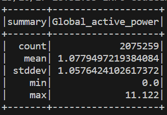
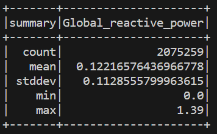
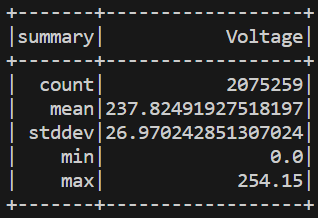
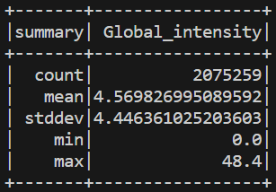
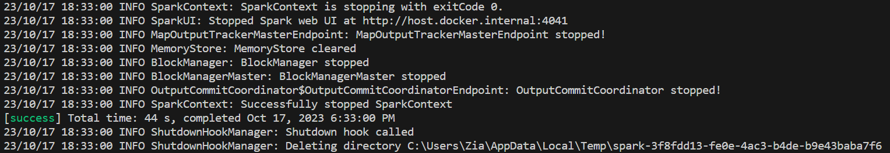

## Personal Info
何芷倩 112598401 資訊所碩一

## PC Spec
1) Processor: Intel(R) Core(TM) i7-10700 CPU @ 2.90GHz   2.90 GHz
2) Installed RAM: 48.0GB

## Versions:
1) Spark: 3.2.4
2) Scala: 2.13.5
3) sbt: 1.9.6
4) Java: 1.8.0_202 (JDK 8u202)
> To set up the spark scala environment using sbt build tool, please see [here](https://dboyliao.medium.com/spark-%E9%96%8B%E7%99%BC-vscode-%E8%88%87-sbt-a9a453d85d51).

## Clarification
This homework is runned in Visual Studio Code with sbt build tool. I have allocated 2GB for the maximum heap size of JVM for better performance using '-J-Xmx2G' in *.sbtopt*.

To run this project:
`$sbt run`

Please place the input file at the outermost layer of the project's directory.
After running the project, 2 folders named "target" will be produced.
The output of sub-task 3 is named "output.txt".
```
├─project
│  └─build.properties
│  └─*target*
├─src
│  └─main
│      └─scala
├─*target*
├─.sbtopts
├─build.sbt
├─*household_power_consumption.txt*
├─output.txt
```

## Generated Output





> Because sbt build tool logs too many information, only the parts that are required for this project are screenshotted.

