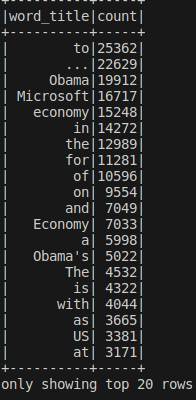
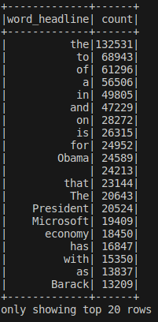
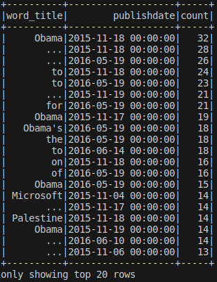
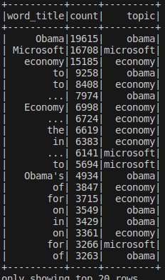
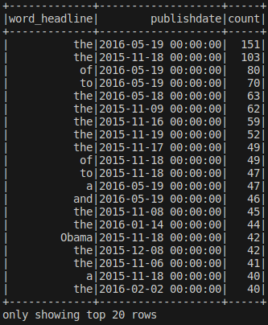
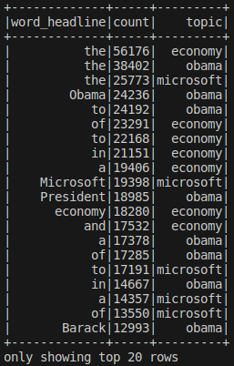
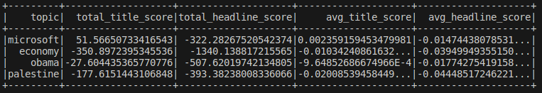
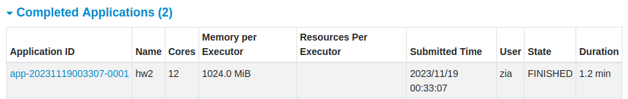

## Personal Info
何芷倩 112598401 資訊所碩一

## Environment and Spec
1) Virtual Box VM Ubuntu20.04LTS
2) 2 nodes in total: 
    a) 8 processors for master node, 4 processors for worker node
    b) Memory: both are 20GB

## Versions:
1) Spark: 3.2.4
2) Scala: 2.12.11
3) sbt: 1.9.6
4) Java: 1.8.0_382

> To set up the spark scala environment using sbt build tool, please see [here](https://dboyliao.medium.com/spark-%E9%96%8B%E7%99%BC-vscode-%E8%88%87-sbt-a9a453d85d51).

To run this project with sbt build tool:
`$sbt run`

To run this project in cluster mode:
1) Start hadoop: `/opt/hadoop/sbin/start-all.sh`
2) Start spark (for web ui only): `/opt/spark/sbin/start-all.sh`
3) Get jar file from current project: `sbt package`
4) Submit file to hadoop hdfs: 
    a) Create the directory in HDFS if not existed: HDFS dfs -mkdir -p hdfs://<spark-master-ip>:9000/user/username/
    b) Copy file to HDFS: hdfs dfs -copyFromLocal /absolute/path/to/input/file hdfs://<spark-master-ip>:9000/user/username
    c) To see whether file exists: hdfs dfs -ls hdfs://<spark-master-ip>:9000/user/username
5) Submit to spark: `/path/to/spark/bin/spark-submit --master spark://<spark-master-ip>:7077 /path/to/your/project.jar  --deploy-mode cluster --driver-memory 8G --executor-memory 4G`

To view the project status in spark web ui please visit *http://<spark-master-ip>:8080*

Please place the input file at the outermost layer of the project's directory.
In HW2, all csv files should be placed in a folder named "Data".
After running the project with *sbt run*, 2 folders named "target" will be produced.
```
├─project
│  └─build.properties
│  └─*target*
├─src
│  └─main
│      └─scala
├─*target*
├─.sbtopts
├─build.sbt
├─*input_file.txt*
├─output.txt
```

## Generated Output
1) (Q1) Total title word count: 
2) (Q1) Total headline word count: 
3) (Q1) Title most frequent words by date: 
4) (Q1) Title most frequent words by topic: 
5) (Q1) Headline most frequent words by date: 
6) (Q1) Headline most frequent words by topic: 
7) (Q2) CSV files named in *Q2_${platform}_by_day.csv* and *Q2_${platform}_by_hour.csv*.
8) (Q3) Sum and average sentiment score of each topic: 
9) (Q4) CSV files named in the folders *${topic}_headline.csv* and *${topic}_title.csv* (Sorry for misleading by adding extension 'csv' to each folder).
10) Cluster mode execution time:  

## Homework information
1) input file: [News Popularity in Multiple Social Media Platforms](https://archive.ics.uci.edu/dataset/432/news+popularity+in+multiple+social+media+platforms) from UCI ML Repository
